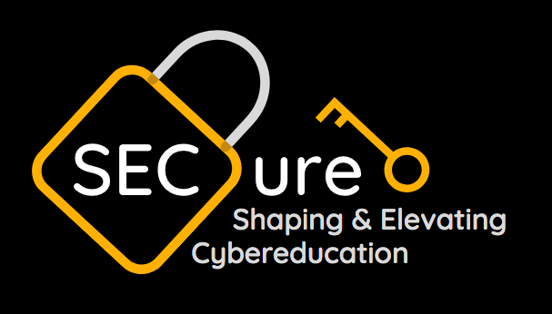

# SECure

SECure is committed to alleviating poverty across the globe through Cybersecurity education. We aim to reduce the gap between the world's high demand for Cybersecurity skills and low supply of trained employees in the field.  While a career in Cybersecurity could be beneficial to many, some may not have access to an affordable and accessible training process in which they can learn necessary skills and receive certification to work in the field of Cybersecurity.

Through SECure, clients can fulfill all of these requirements in preparation for entering the Cybersecurity field in a much more economical and efficient way.  We provide low-cost courses, exposure to experts and mentors in the field, and specialized tracks to gain certifications in Cybersecurity.  Clients will not only SECure a career in a high demanding and growing industry, but help SECure the virtual world as we know it.

Created for Social Impact Hackathon: Democratizing Education in Technology - Awarded 2nd Place

## Usage Insructions 

You can view the structure of our project through the SECure.html file.  This website introduces SECure and outines the services we provide to users.
